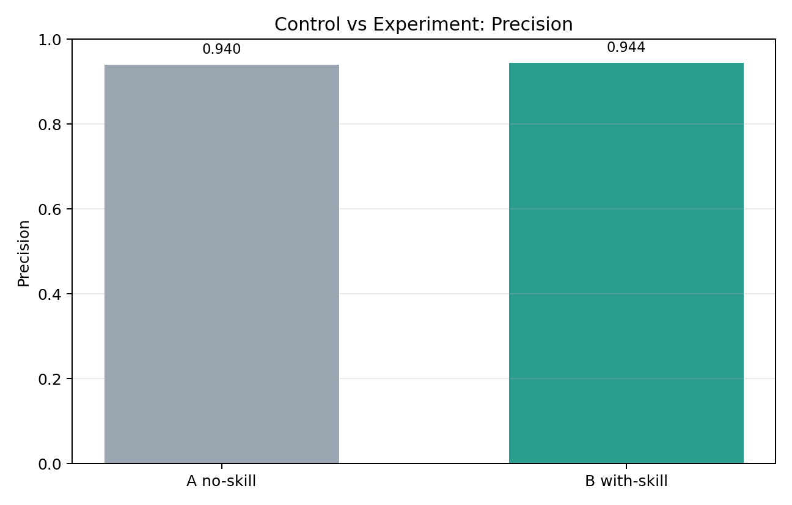
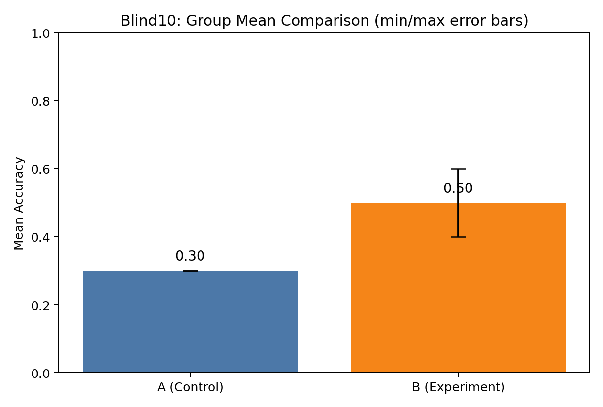
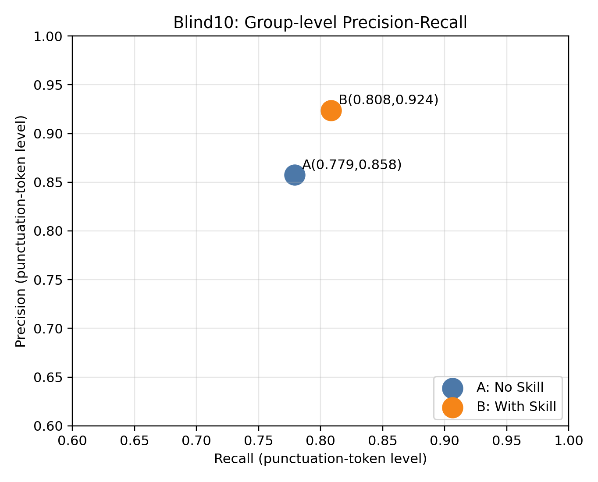
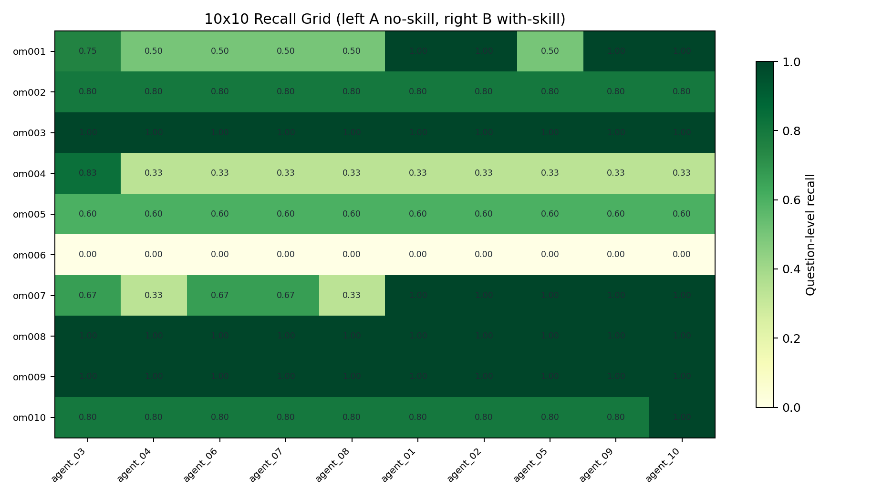

# Chinese Punctuation Sentence Correction

## 中文

### 这是什么

这是一个中文**标点纠错** Skill，专门用于修正逗号、顿号、分号、冒号、引号、括号、省略号、破折号等常见标点错误。

### 适用场景

- 病句修改中的标点专项纠错
- 新闻稿/公文/说明文的标点规范化
- 不希望改动原文语义、只做最小标点修正

### 性能（当前实验）

在官媒 10 题盲测（5v5）中：

- 无 skill 组均准确率：**0.30**
- 有 skill 组均准确率：**0.50**
- 平均提升：**+0.20**

实验明细：`evaluation/blind10_scores.json`

#### 实验可视化

**1) 各智能体准确率**

**2) 组均值对比（A=无skill，B=有skill）**

**3) Precision-Recall（组级两个点）**

**4) 10×10 格子图（左5列无skill，右5列有skill）**

---

## English

### What it does

This skill focuses on **Chinese punctuation correction** (comma, enumeration comma, semicolon, colon, quotes, brackets, ellipsis, dash, etc.).

### Best for

- punctuation-focused sentence correction
- formal writing cleanup (news/official text style)
- minimal edits while preserving original meaning

### Performance (current benchmark)

Blind 10-item official-media benchmark (5v5 setup):

- No-skill group mean accuracy: **0.30**
- With-skill group mean accuracy: **0.50**
- Mean uplift: **+0.20**

Details: `evaluation/blind10_scores.json`

#### Visual Results

